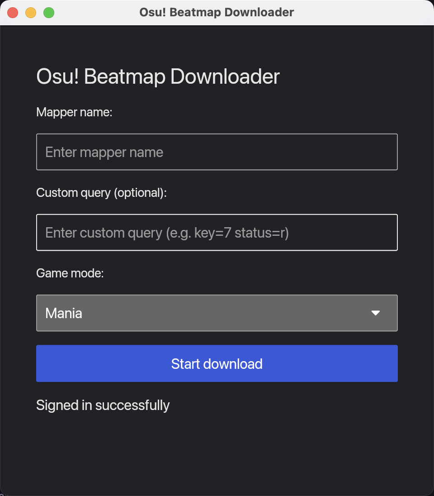

# Osu! Beatmap Downloader

A small desktop app to search and download osu! beatmap sets out-of-the-box.

<div align="center">
  
</div>

中文文档：请查看 [docs/README-zh.md](./docs/README-zh.md)

## ✨ Features
- Search by mapper name and/or custom query
- Select game mode (std, taiko, catch, mania)
- Concurrent downloads with progress bars
- Skips duplicates if your local osu Songs folder is found

## 🚀 Usage
- Enter a mapper name and/or a custom query
    - The query format is consistent with the format used by the official website's search engine [here](https://osu.ppy.sh/beatmapsets?s=any).
    - While it's possible, we don't recommend downloading using only custom queries (e.g. only use "status=r"), as it will take the app a significant amount of time to find matching beatmaps.
- Pick a game mode
- Click “Download” and wait for completion.
- Downloading progress is visible in terminal.
- Downloaded files are saved to the local `./Songs` directory

## ⚙️ Configuration
- **Optional**: set `OSU_PATH` to help the app find your game folder and skip already-installed maps. If not set, the app will try to find it in various default paths.
  - Windows example:
    ```bash
    set OSU_PATH=C:\Games\osu\osu!.exe
    ```
  - Linux/macOS example:
    ```bash
    export OSU_PATH=/path/to/osu
    ```
- Alternatively, you can place the application in the same directory as osu.exe.

## 🛠️ Build
For developers.
###  Requirements
- Rust (stable) and Cargo

###  Installation
```bash
rustup install stable
git clone https://github.com/nicelife1450/osu-downloader
cd osu-downloader
cargo build
```

## 🐞 Troubleshooting
- “Not signed in yet”: wait a few seconds; the app logs in automatically.
- “No beatmaps found”: adjust mapper/query or game mode.
- Download errors: check network connectivity and try again later.

## 📝 Notes
- Beatmaps are downloaded from a public mirror for personal, non-commercial use.
- Respect osu! community rules and the mirror’s terms of service.

## Thanks
- [Sayobot](https://osu.sayobot.cn/home) and [rosu-v2](https://github.com/MaxOhn/rosu-v2) for their fantastic API.
